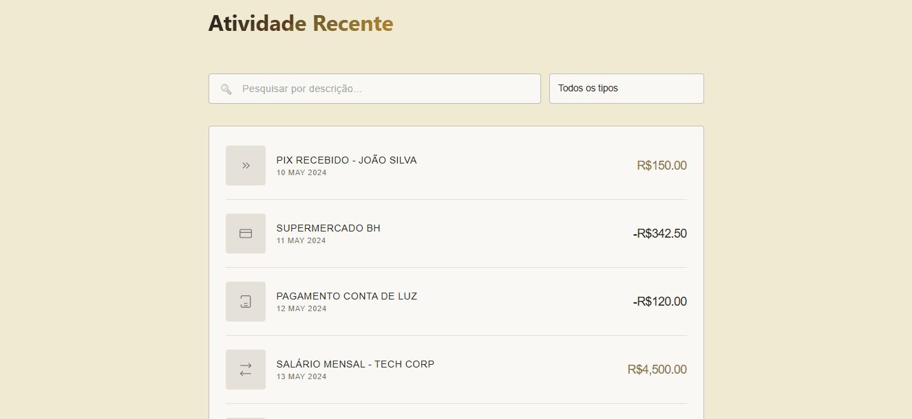

# Módulo Reativo de Extrato Financeiro com Filtros Dinâmicos

Plataforma digital para auditoria de lançamentos e monitoramento de fluxo de caixa corporativo desenvolvida com Angular. A aplicação adota a arquitetura de App Shell para renderização modular e desacoplada, utilizando a engine de reatividade nativa do framework baseada em Signals e Computed States para processamento e filtragem de grandes volumes de transações em tempo real.

---

## Demonstração Visual



---

## Indicadores de Auditoria e Desempenho (Lighthouse Audit)

O módulo de extrato bancário foi submetido à auditoria oficial do Google Lighthouse, apresentando os seguintes resultados consolidados de engenharia frontend:

### Simulação Mobile (Dispositivos Móveis)
* **Melhores Práticas (100/100)**: Pontuação máxima em segurança digital, conformidade com a Web API e arquitetura limpa de componentes standalone.
* **Acessibilidade (92/100)**: Zona de excelência. Rótulos e semântica de tags estruturados para conformidade com leitores de tela e acessibilidade digital.
* **SEO (90/100)**: Metadados estruturados e indexação otimizada para motores de busca.
* **Performance (46/100)**: Pontuação esperada para o carregamento e renderização de tabelas de dados sob redes móveis lentas simuladas. O sistema mantém o tempo de processamento otimizado devido à atualização cirúrgica do DOM através de Angular Signals.

### Simulação Desktop (Computador)
* **Performance (71/100)**: Elevada taxa de interatividade e resposta instantânea do motor de busca.
* **Melhores Práticas (100/100)**: Total conformidade estrutural.
* **Acessibilidade (92/100)**: Navegação e contrastes estáveis.
* **SEO (90/100)**: Alinhamento pleno com as diretrizes de busca.

---

## Engenharia de Software e Diferenciais Técnicos

O desenvolvimento do sistema de auditoria priorizou práticas de governança de código e otimização de runtime para manter a integridade dos dados sob fluxos reativos complexos:

* **Computação e Filtragem Combinada por Estados Derivados (Computed Signals)**: O mecanismo de cruzamento de dados intercepta três fontes de Signals independentes (registros originais, termos textuais da busca e chaves seletoras de tipo). Através do construtor funcional `computed`, o sistema unifica esses estados e calcula a matriz filtrada final exclusivamente quando ocorre mutação direta nas entradas, otimizando o consumo de CPU.
* **Mecanismos de Programação Defensiva contra Falhas de Runtime**: A esteira de processamento implementa sanitizações preventivas e checagens lógicas nas propriedades de payloads externos. Ao forçar a conversão automática para coleções vazias (`|| []`) e validar a existência de strings antes de invocar métodos de normalização de caixa (`toLowerCase`), o sistema blinda o runtime contra quebras provocadas por dados indefinidos ou corrompidos de servidores de API.
* **Identidade Visual Corporativa e Tipografia Avançada**: A folha de estilos adota propriedades de mascaramento vetorial avançado (`background-clip: text`) integradas a gradientes cromáticos lineares para estilização de títulos. O design corporativo é reforçado pelo uso de geometrias retas (`border-radius: 4px`), linhas de separação em prata escovada e distribuições espaciais baseadas em CSS Grid assimétrico, elevando o rigor institucional da interface.
* **Isolamento de Estado Estático via Estratégias Passivas**: O componente de exibição de saldos adota de forma estrita o `ChangeDetectionStrategy.OnPush` casado com os novos inputs reativos baseados em Signals. Esta modelagem desvincula o widget de verificações de ciclo de vida desnecessárias e globais do framework, forçando a reavaliação de layout exclusivamente quando as propriedades de saldo, entradas ou saídas sofrem mutação direta.

---

## Estrutura Funcional e Componentização

A aplicação divide suas responsabilidades em unidades modulares de apresentação e inteligência de negócio:

* **Extrato Component**: Componente orquestrador responsável pela ingestão de dados via serviços, gerenciamento do estado reativo global e distribuição dos fluxos filtrados.
* **Filtros Component**: Widget autônomo (Dumb Component) dedicado à interceptação de inputs textuais e seleções de categoria, utilizando a API `output<string>()` para comunicação unidirecional ascendente.
* **Lista Transações Component**: Painel contábil encarregado da renderização de lançamentos utilizando a nova diretiva estrutural `@for` combinada com o gatilho de tratamento de listas vazias `@empty`.
* **Resumo Saldo Component**: Módulo de balanço patrimonial responsável pelo processamento de fluxos de caixa e realces cromáticos para saldos líquidos negativos ou positivos.

---

## Tecnologias e Recursos Utilizados

* **Angular**: Standalone Components, Signals de Reatividade Granular, Computed States e Controle de Fluxo Nativo.
* **TypeScript**: Controle estrito de contratos de tipos e tipagens defensivas.
* **SCSS Comercial**: Uso de mixins de profundidade, seletores `:host`, variáveis nativas, propriedades de mascaramento de texto e animações de interpolação linear (`keyframes`).
* **Web APIs**: Mecanismos nativos de vetorização SVG injetados com segurança através da API `DomSanitizer` do framework.

---

## Fluxo Interno de Processamento de Filtros (Data Pipeline)

A esteira de transformação de dados computa as buscas através do seguinte fluxo sequencial:
1. Captura reativa de mutações nos inputs de pesquisa e seleção na camada visual.
2. Normalização de strings via tratamento de espaçamentos periféricos (`.trim()`) e caixa baixa (`.toLowerCase()`).
3. Avaliação de correspondência textual e categorização tipográfica concorrentes sobre o array imutável de transações.
4. Despacho automatizado do vetor resultante para renderização granular das linhas no DOM.

---

## Instruções para Execução do Projeto

A aplicação necessita do ecossistema Node.js instalado no ambiente de desenvolvimento local:

1. Clone o repositório utilizando o comando:
   ```bash
   git clone https://github.com
   ```
2. Instale as dependências e pacotes de desenvolvimento estruturais do projeto:
   ```bash
   npm install
   ```
3. Inicialize o servidor de desenvolvimento local:
   ```bash
   ng serve
   ```
4. Acesse o sistema através do endereço fornecido pelo compilador em seu navegador local: `http://localhost:4200`
